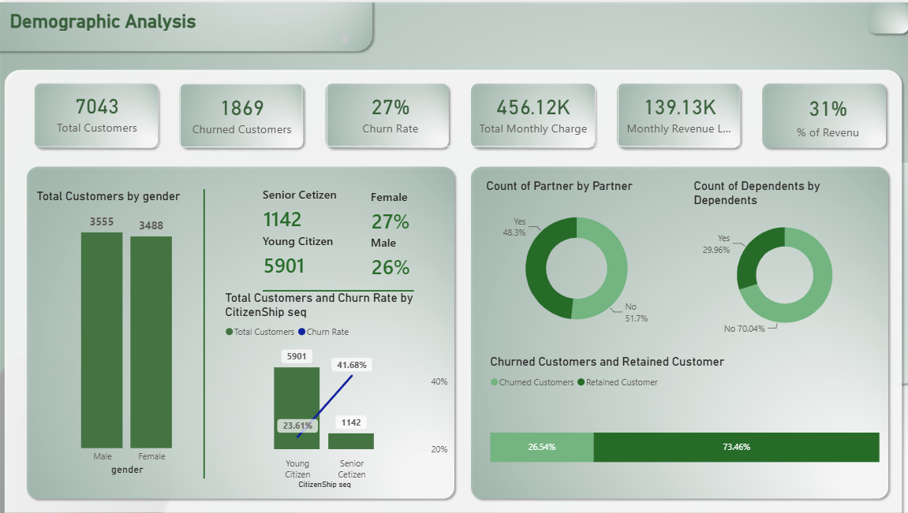
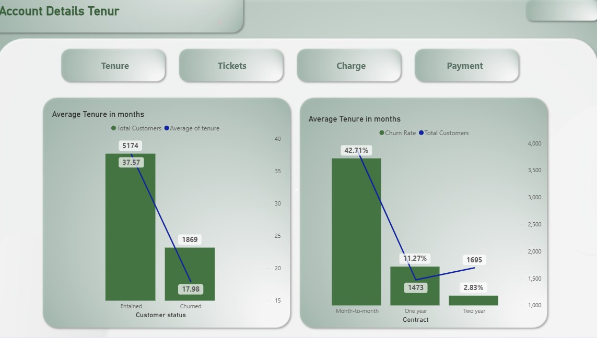
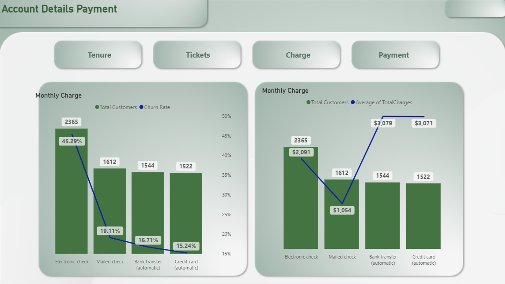
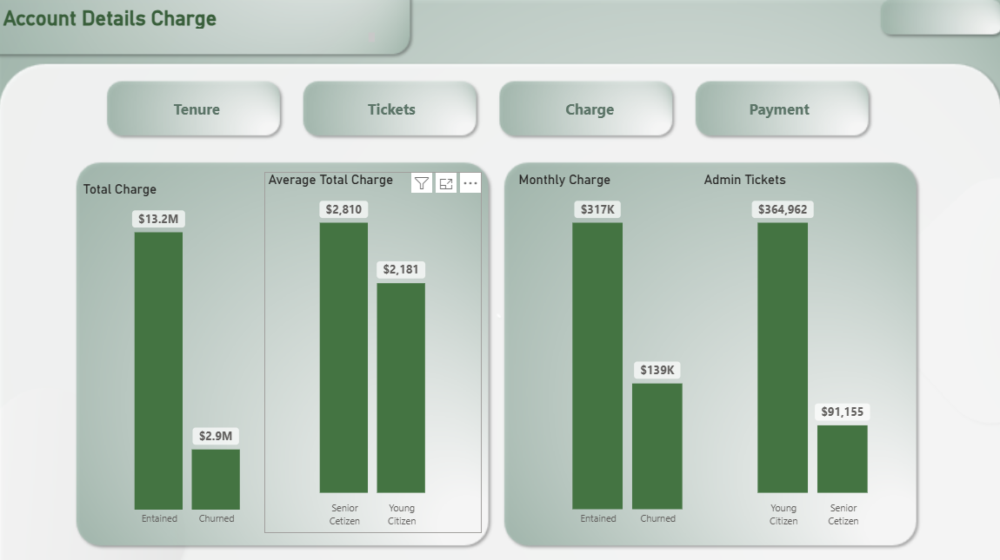
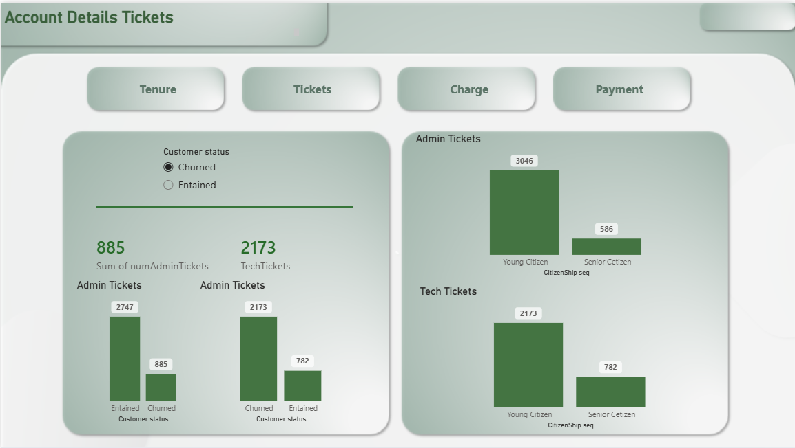

# Telco Customer Churn Dashboard

A Power BI dashboard analyzing customer churn behavior for a telecom company, built to help stakeholders understand why customers leave and where to focus retention efforts.

## Project Overview

Customer churn directly affects recurring revenue. This dashboard breaks down the customer base by contract type, payment method, tenure, and support activity to surface the segments most at risk of churning, and quantifies the revenue impact of that churn.

## Business Objectives

- Measure overall churn rate and track it against retained customers
- Identify which contract types and payment methods correlate with higher churn
- Quantify monthly revenue lost to churned customers
- Highlight the effect of support ticket volume (admin/technical) on customer retention
- Give stakeholders a KPI view they can act on without digging into raw data

## Dataset Description

The dataset (`01 Churn-Dataset`) is the well-known **IBM Telco Customer Churn** sample dataset — anonymized, publicly available sample data used for churn-analysis training and demos (no real customer PII). Key fields used in this report:

| Field | Description |
|---|---|
| `gender`, `Partner`, `Dependents` | Customer demographics |
| `tenure` | Months the customer has stayed with the company |
| `Contract` | Contract type (month-to-month, one year, two year) |
| `PaymentMethod` | How the customer pays |
| `MonthlyCharges`, `TotalCharges` | Billing amounts |
| `Customer status` | Active / Churned |
| `numAdminTickets`, `numTechTickets` | Support tickets raised by the customer |

A separate `KPIS Measures` table holds the calculated DAX measures (Churn Rate, Retained Customers, Monthly Revenue Loss, % of Revenue, Total Customers, Total Monthly Charge).

## Tools & Technologies

- Power BI Desktop (data modeling, DAX measures, report design)
- DAX for KPI calculations
- Power Query for data shaping

## Dashboard Preview

The report has 5 pages: **Demographic Analysis** (overview), and **Account Details** broken down by Tenure, Tickets, Charge, and Payment.

### Demographic Analysis


### Account Details — Tenure


### Account Details — Payment


### Account Details — Charge


### Account Details — Tickets


## Key KPIs

| Metric | Value |
|---|---|
| Total Customers | 7,043 |
| Churn Rate | 27% |
| Churned Customers | 1,869 |
| Retained Customers | 5,174 (73.46%) |
| Total Monthly Charge | $456.12K |
| Monthly Revenue Loss (churned) | $139.13K |
| % of Revenue Lost | 31% |

## Key Insights

- **Payment method is the strongest churn signal.** Customers paying by **Electronic check** churn at **45.29%** — roughly 2.4–3x the rate of mailed check (19.11%), bank transfer (16.71%), or credit card (15.24%), despite Electronic check also being the largest segment (2,365 customers).
- **Contract length strongly predicts retention.** Month-to-month customers churn at **42.71%**, versus **11.27%** for one-year and just **2.83%** for two-year contracts.
- **Tenure gap between churned and retained customers is large.** Retained customers average **37.6 months** of tenure vs. **18 months** for churned customers — churn is heavily front-loaded in the customer lifecycle.
- **Senior citizens churn disproportionately more.** Senior citizens churn at **41.68%** vs. **23.61%** for younger customers, even though they're a much smaller segment (1,142 vs 5,901 customers).
- **Support ticket load correlates with churn.** Churned customers raised proportionally more technical tickets (2,173 tech tickets among churned vs. 782 among retained), suggesting unresolved support issues are a churn driver.

## Business Recommendations

- Target retention offers/incentives at **electronic check** users specifically — the highest-churn, highest-volume payment segment.
- Push month-to-month customers toward **one- or two-year contracts** (e.g. discounts for longer commitments) given the sharp drop in churn rate with contract length.
- Build a proactive outreach flow for customers in their **first ~18 months**, since that's when most churn happens.
- Prioritize faster resolution for **technical support tickets** — ticket volume tracks closely with churn.
- Review the **senior citizen** experience specifically, since this segment churns at nearly double the rate of younger customers.

## Repository Structure

```
Telco-Customer-Churn-Dashboard/
├── Power BI/
│   └── Customers.pbix
├── Images/
│   ├── demographic-analysis.png
│   ├── account-details-tenure.png
│   ├── account-details-payment.png
│   ├── account-details-charge.png
│   └── account-details-tickets.png
└── README.md
```

## Skills Demonstrated

- Data modeling and relationships in Power BI
- DAX measures for KPI calculation
- Dashboard/report design for business stakeholders
- Churn analysis methodology

## About the Author

Mohamed Farag Saied
